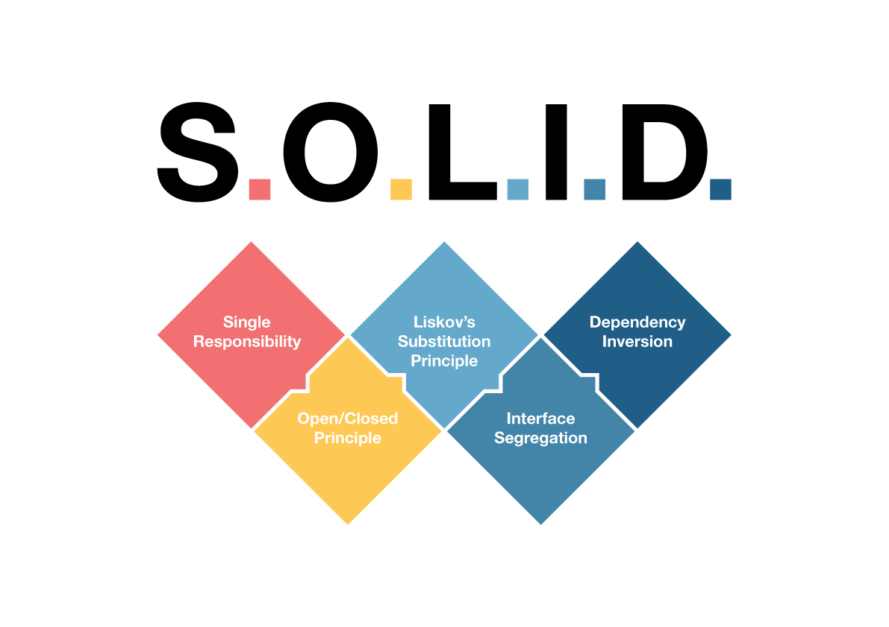

# SOLID-study



Estudos sobre SOLID aplicado em JavaScript.

# Descrição:

SOLID é originalmente um conjunto de princípios de design patterns voltados a POO (Programação Orientada a Objetos) identificados por Robert C. Martin, também conhecido como Uncle Bob, que caso seguidas trazem diversos benefícios técnicos e evitam alguns problemas relacionados á estrutura do código.

De acordo com próprio Uncle Bob, os benefícios do SOLID são universais, tangíveis a todo modelo de programação e código, e que os princípios são adaptáveis ás necessidades de quem tem um problema que envolve desenvolvimento de software.


## S (Single Responsibility Principle / Princípio de Responsibilidade Única):

O SRP afirma que uma classe ou módulo deve ter uma única razão para mudar. Isso significa que cada componente do software deve ter uma única área de responsabilidade e não deve se envolver em múltiplas tarefas ou funcionalidades. Se uma classe ou módulo tiver mais de uma responsabilidade, pode ser difícil de entender, manter e testar. Além disso, quando ocorrerem mudanças em uma das responsabilidades, pode haver impactos indesejados em outras partes do código, levando a um código frágil e propenso a erros.

O SRP incentiva a separação de preocupações e o design de código coeso, onde cada componente é especializado em uma única responsabilidade. Isso ajuda a melhorar a manutenibilidade, testabilidade e reusabilidade do código, facilitando a compreensão de suas funcionalidades e isolando os efeitos de mudanças em uma única área.

Na linguagem funcional, aplicar esta lógica é simples, principalmente na relação classe-function e module-function que, até mesmo visualmente, é fácil de perceber. Aplicar uma lógica unitária em uma function em um módulo em nada difere de POO e tem os mesmos ganhos. A adaptabilidade é total.

Exemplo:
<br/>

```markdown
    const firstName = "Lucas";
    const lastName = "Silva";
    let fullName;

    function fullNameGeneration(name, lastname){
        return `${name} ${lastname}`;
    }

    function lowerCaseFullName(name){
        return name.toLocaleLowerCase();
    }

    fullName = fullNameGeneration(firstName, lastName);

    console.log(["Full Name: ",fullNameGeneration(firstName, lastName)]);

    // Result Lucas Silva;
```

Neste código existem duas funções isoladas com responsabilidade única e especialista em sua área. A primeira função "fullNameGeneration" é responsável por pegar o nome e sobrenome e retornar o nome completo. A segunda função recebe um nome e aplica letras minúsculas à string.

Observando este código é possível perceber que as funções não estão interligadas e são responsáveis ​​por sua especialidade.

## O (Open-Closed Principle / Princípio Aberto-Fechado):

Este princípio postula que você pode mudar o comportamento do seu sistema sem mudar o código. Basicamente, este princípio nos permite escalar sistemas sem a necessidade de alterá-los, apenas adicionando novas funcionalidades.

Em outras palavras, uma classe ou módulo deve estar fechado para modificações, mas aberto para extensões. Isso significa que você deve poder adicionar novos comportamentos ou funcionalidades sem precisar alterar o código-fonte existente.

Exemplo:
<br/>

```markdown
const makeGenericSound = () => {
  console.log('Som de animal genérico');
};

const makeCatSound = () => {
  console.log('Meow!'); // Som de gato
};

const makeDogSound = () => {
  console.log('Woof!'); // Som de cachorro
};

const Animal = (name, makeSoundFn) => {
  return {
    name,
    makeSound: makeSoundFn
  };
};

const Cat = (name) => {
  return Animal(name, makeCatSound);
};

const Dog = (name) => {
  return Animal(name, makeDogSound);
};

const animal1 = Animal('Animal Genérico', makeGenericSound);
const cat1 = Cat('Gato Fofo');
const dog1 = Dog('Cachorro Amigável');

animal1.makeSound(); // Output: Som de animal genérico
cat1.makeSound(); // Output: Meow!
dog1.makeSound(); // Output: Woof!
```

Exemplo de aplicação do Princípio Aberto-Fechado com programação funcional. No exemplo acima, usamos funções para representar as classes e os métodos. A função Animal aceita um nome e uma função de makeSound como argumentos e retorna um objeto que representa um animal com seu nome e a função de makeSound específica para aquele animal. As funções makeCatSound e makeDogSound são as implementações específicas de som para gato e cachorro, respectivamente. As funções Cat e Dog são usadas para criar objetos que representam animais específicos, passando o nome e a função de makeSound correspondente.

## L (Liskov Substitution Principle / Princípio de Substituição de Liskov):

Este princípio define que os objetos de uma superclasse devem poder ser substituídos por objetos das subclasses sem quebrar a aplicação. O que requer que o comportamento dos objetos das subclasses sejam homólogos aos da superclasse.Em outras palavras, os objetos derivados devem ser substituíveis pelos objetos da classe base sem alterar o comportamento esperado do programa.

Esta visão é como um acordo entre partes, que decide os padrões de composição do código, similar com o conceito de design por contrato de Bertrand Meyer. Um acordo é ótimo para o bom funcionamento de um código e o beneficia através de padrões estabelecidos entre funções de entrada e suas saídas em funções de ordem superior no paradigma funcional.

```markdown
const Animal = (name) => {
  return {
    name,
    makeSound: () => {
      console.log('Som de animal genérico');
    }
  };
};

const Cat = (name) => {
  const animal = Animal(name);

  // Sobrescreve o método makeSound apenas para gatos
  animal.makeSound = () => {
    console.log('Meow!'); // Som de gato
  };

  return animal;
};

const Dog = (name) => {
  return Animal(name);
};

const animal1 = Animal('Animal Genérico');
const cat1 = Cat('Gato Fofo');
const dog1 = Dog('Cachorro Amigável');

animal1.makeSound(); // Output: Som de animal genérico
cat1.makeSound(); // Output: Meow!
dog1.makeSound(); // Output: Som de animal genérico (mesmo comportamento do Animal genérico)

```

No exemplo acima, usamos funções para representar as classes e os métodos. A função Animal aceita um nome e retorna um objeto que representa um animal com seu nome e um método makeSound genérico. A função Cat cria um objeto que representa um gato, derivando de Animal e sobrescrevendo o método makeSound para implementar o som de gato. A função Dog cria um objeto que representa um cachorro, usando apenas o comportamento do Animal genérico.

## I (Interface Segregation Principle ou ISP / Princípio da segregação de Interface)

Este princípio diz que o uso de interfaces deve ser feito de forma específica, e que ter várias interfaces bem específicas é melhor do que ter uma grande que redireciona para todos. O princípio se baseia em “nenhum cliente deve ser forçado a depender de métodos que não utiliza”.

Isto faz com que a manutenção do sistema seja muito mais desacoplada e assim, torna-se fácil implementar novos códigos, desde que neste padrão. No paradigma funcional, criando o mínimo de campos obrigatórios para que o sistema opere em uma struct única que irá ser passada em uma função de entrada, consegue-se alcançar resultados análogos ao que acontece em POO.

 Em outras palavras, uma classe não deve ser forçada a depender de interfaces que não utiliza. Aqui está um exemplo em JavaScript usando programação funcional:

```markdown
  // Exemplo de aplicação do Princípio da Segregação de Interfaces com programação funcional

  // Interface para um animal que emite som
  const Soundable = (makeSoundFn) => {
    return {
      makeSound: makeSoundFn
    };
  };

  // Implementação da interface Soundable para gatos
  const Cat = (name) => {
    return {
      name,
      makeSound: () => {
        console.log('Meow!'); // Som de gato
      }
    };
  };

  // Implementação da interface Soundable para cachorros
  const Dog = (name) => {
    return {
      name,
      makeSound: () => {
        console.log('Woof!'); // Som de cachorro
      }
    };
  };

  // Implementação da interface Soundable para aves
  const Bird = (name) => {
    return {
      name,
      makeSound: () => {
        console.log('Tweet!'); // Som de ave
      }
    };
  };

  // Cliente que utiliza a interface Soundable
  const playSound = (animal) => {
    animal.makeSound();
  };

  // No exemplo acima, usamos funções para representar as classes e os métodos, e a função Soundable representa a interface que define o comportamento de emitir som. As funções Cat, Dog e Bird são as implementações específicas de animais que implementam a interface Soundable. O cliente `playSound` utiliza a interface Soundable, permitindo que qualquer objeto que implemente essa interface possa ser passado como argumento, sem se importar com a implementação específica do animal.

  const cat1 = Cat('Gato Fofo');
  const dog1 = Dog('Cachorro Amigável');
  const bird1 = Bird('Pássaro Colorido');

  playSound(cat1); // Output: Meow!
  playSound(dog1); // Output: Woof!
  playSound(bird1); // Output: Tweet!
```

## D (Dependency Inversion Principle / Princípio de Segregação de Interface)

Este princípio diz que o seu sistema precisa ter alta coesão e baixo acoplamento. Basicamente é você fazer com que módulos e funções relacionadas se comuniquem com funções não relacionadas o mínimo possível, o que independente do paradigma é uma boa prática.

Resumindo, essa dependência propõe que as classes de alto nível não devem depender de classes de baixo nível diretamente, mas sim de interfaces abstratas. Além disso, esse princípio também preconiza que as abstrações não devem depender de detalhes concretos, ou seja, os detalhes de implementação devem depender das abstrações. Isso promove um desacoplamento entre as classes, permitindo maior flexibilidade, extensibilidade e reutilização do código. 

```markdown

  // Exemplo de aplicação do Princípio da Inversão de Dependência com programação funcional

  // Interface abstrata para um reprodutor de mídia
  const MediaPlayer = (playFn) => {
    return {
      play: playFn
    };
  };

  // Implementação concreta de um reprodutor de mídia de áudio
  const AudioPlayer = () => {
    return {
      play: () => {
        console.log('Reproduzindo áudio...'); // Lógica de reprodução de áudio
      }
    };
  };

  // Implementação concreta de um reprodutor de mídia de vídeo
  const VideoPlayer = () => {
    return {
      play: () => {
        console.log('Reproduzindo vídeo...'); // Lógica de reprodução de vídeo
      }
    };
  };

  // Classe de alto nível que depende da interface abstrata MediaPlayer
  const App = (mediaPlayer) => {
    return {
      playMedia: () => {
        mediaPlayer.play();
      }
    };
  };

  // Cliente que utiliza a classe de alto nível App
  const app = App(AudioPlayer()); // Instância do reprodutor de mídia de áudio
  app.playMedia(); // Output: Reproduzindo áudio...

  const app2 = App(VideoPlayer()); // Instância do reprodutor de mídia de vídeo
  app2.playMedia(); // Output: Reproduzindo vídeo...

```

# Sobre o projeto:

Esse projeto foca em reproduzir um sistema de cadastro de alunos, aulas e professores usando o aprendizado de S.O.L.I.D..
